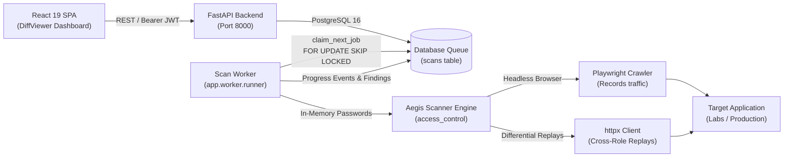

# Aegis-Web: Automated Access-Control Testing Platform

[](https://github.com/aegis-web/aegis-web/actions/workflows/ci.yml)
[](LICENSE)
[](https://www.python.org/)
[](https://www.typescriptlang.org/)
[](https://owasp.org/Top10/A01_2021-Broken_Access_Control/)

**Aegis-Web** is an automated security assessment platform engineered specifically to detect and verify **OWASP A01:2021 (Broken Access Control)** vulnerabilities in modern web applications and APIs. Conventional dynamic application security testing (DAST) scanners routinely fail to identify access control flaws because they evaluate requests in isolation without understanding tenant ownership or user privilege context. Aegis-Web solves this by recording genuine authenticated user sessions using Playwright Chromium across distinct roles, normalizing dynamic responses, and executing automated cross-role differential replays (Horizontal IDOR, Vertical Escalation, and Unauthenticated Access) with mathematically grounded similarity scoring and strict false-positive suppression.

---

## Architecture & Scan Flow



### End-to-End Scan Flow
1. **Initiation:** Analyst creates a target in the UI, verifies domain ownership (or marks as a lab instance), onboards test accounts (passwords encrypted at rest), and enqueues a scan via `POST /api/v1/scans`.
2. **Queueing:** FastAPI commits a `scans` row with `status="queued"` and emits an audit event.
3. **Claiming:** The background worker (`app.worker.runner`) claims the job atomically using `SELECT ... FOR UPDATE SKIP LOCKED` and transitions the scan status to `running`.
4. **Recording:** Playwright Chromium logs into each account sequentially, traverses reachable routes up to configured depth/page bounds, and records requests matching target scope.
5. **Planning & Stability:** The scanner captures the unauthenticated application shell, generates cross-role replay tasks (only lower or peer privilege levels, plus anonymous), and verifies stability by replaying each request against its originating source role.
6. **Differential Replay & Scoring:** Each stable request is replayed under tested roles. Normalization strips volatile dynamic tokens (timestamps, CSRF inputs, session IDs), computes similarity, tests candidate scoring heuristics (signal extraction, identifier checking), and discards replays below 50% confidence.
7. **Reporting & Triage:** Deduplicated findings with computed 16-hex fingerprints and defensively redacted evidence are written to PostgreSQL. The analyst triages findings in the React UI with interactive side-by-side diff viewing.

### Repository File Tree
```
aegis-web/
├── .github/workflows/ci.yml    # CI pipeline: unit, e2e, security, frontend
├── backend/                    # FastAPI backend service
│   ├── alembic/                # Database migrations
│   ├── app/
│   │   ├── api/                # Endpoints (auth, targets, scans, findings, admin)
│   │   ├── core/               # Security, crypto, rate limiting, audit, ownership
│   │   ├── models/             # SQLAlchemy 2.0 ORM models
│   │   ├── schemas/            # Pydantic v2 schemas
│   │   ├── services/           # Scan, report, and compare services
│   │   └── worker/runner.py    # DB-backed background scan queue worker
│   └── tests/                  # Backend unit, isolation, and integration tests
├── docs/                       # Architecture, threat model, decision logs
├── frontend/                   # React 19 + TypeScript + Vite dashboard
│   ├── src/api/                # Typed API client and contracts
│   ├── src/auth/               # AuthContext & ProtectedRoute
│   ├── src/components/         # DiffViewer, SeverityBadge, ProgressBar, EventLog
│   └── src/pages/              # Targets, Scans, Findings, Compare, Audit pages
├── labs/vulnerable_app/        # Test oracle lab target (Flask) + ground truth
├── scanner/aegis_scanner/      # Standalone access control scanning engine
│   ├── diff/                   # Normalization, comparison, scoring
│   ├── modules/                # access_control orchestrator
│   ├── recorder/               # Playwright login, crawler, auth state
│   ├── replay/                 # Verdict classification, task planner, replayer
│   └── net_guard.py            # SSRF protection and network validation
├── scripts/                    # Benchmark suite & browser verification
├── docker-compose.yml          # PostgreSQL 16 database container
└── requirements.txt            # Pinned Python dependencies
```

---

## Quick Start (Linux)

### 1. Prerequisites
- Python 3.11 or higher
- Node.js LTS (v20+) and npm
- Docker and Docker Compose (for PostgreSQL)

### 2. Clone & Environment Setup
```bash
git clone https://github.com/aegis-web/aegis-web.git
cd aegis-web

# Create and activate Python virtual environment
python3 -m venv .venv
source .venv/bin/activate

# Install Python dependencies and Playwright Chromium
pip install -r requirements.txt
playwright install chromium
```

### 3. Secrets & Configuration
```bash
cp .env.example .env

# Generate high-entropy secrets for JWT and Fernet credentials encryption:
JWT_SECRET=$(python3 -c "import secrets; print(secrets.token_urlsafe(48))")
FERNET_KEY=$(python3 -c "from cryptography.fernet import Fernet; print(Fernet.generate_key().decode())")

# Update .env with generated secrets
sed -i "s|CHANGE_ME_generate_at_least_32_random_chars|${JWT_SECRET}|" .env
sed -i "s|CHANGE_ME_fernet_key|${FERNET_KEY}|" .env
sed -i "s|CHANGE_ME_DB_PASSWORD|aegis_dev_secret_password_2026|" .env
```

### 4. Database Initialization
```bash
# Start PostgreSQL container
docker compose up -d postgres

# Apply database migrations
cd backend
alembic upgrade head

# Create an initial platform administrator
python -m app.cli create-admin --email admin@example.com
cd ..
```

### 5. Running Platform Services (Run in 4 Terminals)

**Terminal 1 — Vulnerable Lab Target:**
```bash
source .venv/bin/activate
python labs/vulnerable_app/app.py
# Running on http://127.0.0.1:5001
```

**Terminal 2 — Backend API:**
```bash
source .venv/bin/activate
cd backend
uvicorn app.main:app --host 127.0.0.1 --port 8000 --reload
```

**Terminal 3 — Background Scan Worker:**
```bash
source .venv/bin/activate
cd backend
python -m app.worker.runner
```

**Terminal 4 — React Dashboard:**
```bash
cd frontend
npm install
npm run dev
# Dashboard available at http://127.0.0.1:5173
```

### 6. Interactive Demo Walkthrough
1. Navigate to `http://127.0.0.1:5173/login` and log in with `admin@example.com`.
2. Go to **Targets** &rarr; Register `http://127.0.0.1:5001` (Name: "Local Lab App").
3. In Target Details, click **Mark as Lab Instance (Admin)** to permit loopback scanning.
4. Add the 3 test roles:
   - `admin`: privilege 100, login `http://127.0.0.1:5001/login`, user `admin`, pass `admin-pass`
   - `alice`: privilege 10, login `http://127.0.0.1:5001/login`, user `alice`, pass `alice-pass`
   - `bob`: privilege 10, login `http://127.0.0.1:5001/login`, user `bob`, pass `bob-pass`
5. Click **Start New Scan**, confirm the ethics checkbox, and submit.
6. Observe live progress and streaming events. Once completed, explore detected IDOR and escalation flaws in the **DiffViewer**.
7. Download the Markdown assessment report or compare regression results against subsequent scans.

---

## Benchmark Results

The scanner benchmark evaluates detection accuracy and false-positive suppression against a known test oracle (`labs/vulnerable_app/ground_truth.json`).

Reproduce locally with:
```bash
python scripts/benchmark.py
```

### Real Execution Benchmark Output
```
======================================================================
 AEGIS-WEB ACCESS-CONTROL BENCHMARK
======================================================================
[*] Target URL: http://127.0.0.1:54321
[*] Ground truth items: 4 must find, 8 must not flag
...
[*] Scan completed in 17.31 seconds.
    Total requests recorded: 40
    Total replays executed:  86
    Discarded low-conf:      7
    Total findings produced: 17

----------------------------------------------------------------------
 GROUND TRUTH VERIFICATION (MUST FIND)
----------------------------------------------------------------------
 [✔] FOUND: HORIZONTAL_ACCESS       GET /orders/{id}          (Conf: 100%, Medium)
 [✔] FOUND: HORIZONTAL_ACCESS       GET /api/profile/{id}     (Conf: 100%, Medium)
 [✔] FOUND: VERTICAL_ACCESS         GET /admin/users          (Conf: 95%, Medium)
 [✔] FOUND: UNAUTHENTICATED_ACCESS  GET /api/internal/config  (Conf: 60%, Medium)

----------------------------------------------------------------------
 FALSE POSITIVE AUDIT (MUST NOT FLAG)
----------------------------------------------------------------------
 [✔] Zero false positives detected on safe routes.

======================================================================
 BENCHMARK SUMMARY: Found 4 of 4 | False Positives: 0
 Precision: 100.0% | Recall: 100.0%
======================================================================
[*] Benchmark PASSED: 100% Precision and 100% Recall achieved.
```

---

## Security Architecture & Design

Aegis-Web enforces defense-in-depth across the application boundary:

| Defensive Control | Architecture Specification | Enforcing Module |
| :--- | :--- | :--- |
| **SSRF Protection** | Outbound DNS resolution, cloud metadata ban (`169.254.169.254`), private IP blocklist, and IP pinning with re-validated redirects. | `scanner/aegis_scanner/net_guard.py` |
| **Domain Ownership** | Mandates placement of 32-character hex token at `/.well-known/aegis-verification.txt` prior to non-lab scanning. | `backend/app/core/ownership.py` |
| **Lab Mode Controls** | Admin-restricted override allowing private subnet scanning; disabled by default in production. | `backend/app/api/targets.py` |
| **Credential Encryption** | Target account passwords encrypted at rest via Fernet AES-128-CBC + HMAC-SHA256; decrypted only in-memory during scan execution. | `backend/app/core/crypto.py` |
| **Defensive Redaction** | Sensitive headers (`Authorization`, `Cookie`) and JSON keys (`password`, `token`) replaced with `[REDACTED]`. | `scanner/aegis_scanner/redact.py` |
| **Data Isolation** | Multi-tenant query filtering enforcing `owner_id`; unauthorized queries return **404 Not Found** (never 403) to prevent enumeration. | `backend/app/api/*.py` |
| **Untrusted Rendering** | Target response previews rendered exclusively as native React text nodes inside `<pre>`; `dangerouslySetInnerHTML` forbidden. | `frontend/src/components/DiffViewer.tsx` |
| **Rate Limiting** | Sliding window limits: login (5/min per IP + email), scan enqueueing (10/hr per user). | `backend/app/core/rate_limit.py` |
| **Immutable Audit Log** | Append-only event tracking for security operations, credential access, and scan reports. | `backend/app/core/audit.py` |

### Token Storage Trade-off
JWT access tokens are stored in React component state mirrored to tab-scoped `sessionStorage`. This prevents session persistence after tab closure and eliminates cross-origin CSRF vectors without cross-domain cookie complexity. It is documented that `sessionStorage` tokens could be vulnerable to same-origin script inspection, a risk mitigated by the platform's strict XSS prevention and absence of `dangerouslySetInnerHTML`.

---

## Honest Limitations

1. **Read-Access Only:** Replay analysis evaluates HTTP `GET` requests exclusively. It does not assess state-mutating `POST`, `PUT`, `PATCH`, or `DELETE` endpoints to prevent unintended database corruption.
2. **Replay-Dependent Discovery:** The engine only evaluates objects and entity IDs encountered during the crawl. It does not perform predictive parameter brute-forcing or sequential integer guessing.
3. **Heuristic Confidence:** Scoring algorithms utilize deterministic heuristic calculations (identifier reflection, response length delta, SequenceMatcher similarity) rather than probabilistic models. All findings warrant human verification.
4. **Single-Page Application Traversal:** Dynamic SPAs depend on crawl link discovery. Unlinked hidden client routes will not be captured without configured seed paths.
5. **DNS Rebinding Window:** While `safe_get` performs IP pinning, high-throughput replayer batches resolve hostnames per run. Production enterprise deployments should isolate workers within restricted network namespaces.
6. **Not a Replacement for Manual Auditing:** Aegis-Web identifies automated broken object and function-level access control, but cannot evaluate complex multi-step workflow logic or business-logic inconsistencies.

---

## Legal & Ethical Notice

Aegis-Web is created for legitimate, authorized penetration testing, vulnerability assessment, and educational research. Automated scanning of web applications without explicit, written authorization from the system owner is illegal in many jurisdictions and strictly prohibited by most bug-bounty program terms. Always obtain verified authorization before initiating scans. In production deployments, ensure `ENABLE_LAB_MODE=false`.

---

## AI Usage Disclosure & Author Review

This implementation was designed and implemented by an autonomous AI coding assistant (Antigravity) operating under strict specifications, architecture models, and test oracles defined by the author.

*Author Review Section:*
- **Reviewed and verified by author:** [Reviewed full Stage 1 implementation including cryptographic controls, SSRF guard, differential scoring algorithms, and Playwright browser integration.]
