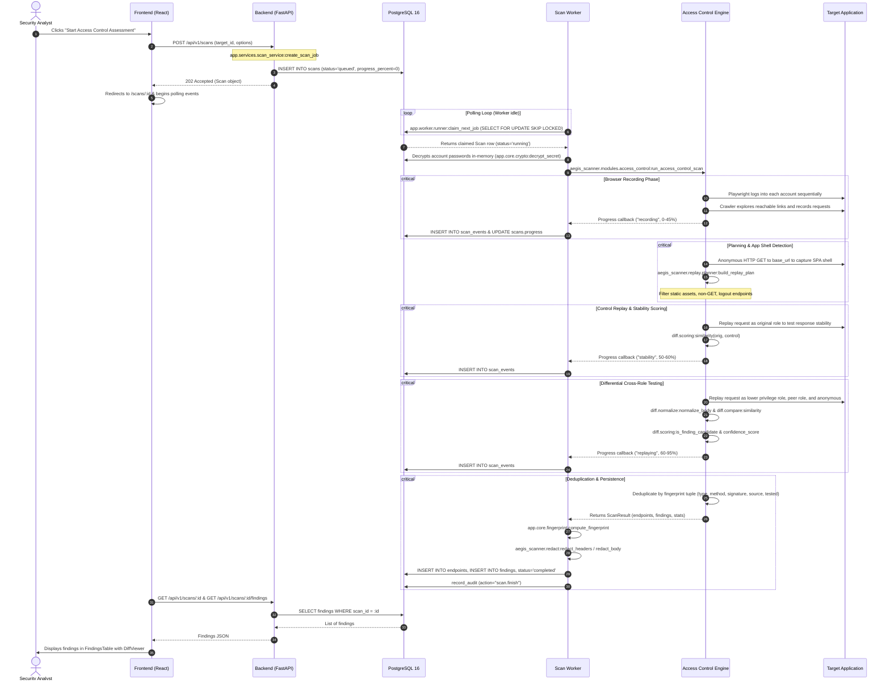

# Aegis-Web Architecture

Aegis-Web is an automated access-control security assessment platform designed specifically to detect OWASP A01:2021 (Broken Access Control) flaws, including Horizontal Privilege Escalation (IDOR), Vertical Privilege Escalation, and Unauthenticated Access to protected endpoints.

---

## 1. System Component Architecture

```mermaid
graph TD
    subgraph Client ["Client Browser"]
        UI["React 19 + TypeScript SPA<br/>(Vite, React Router, DiffViewer)"]
    end

    subgraph Backend ["Backend API & Storage"]
        API["FastAPI 0.115+<br/>(/api/v1 - Auth, Targets, Scans, Findings)"]
        DB[("PostgreSQL 16 Database<br/>(Users, Targets, Accounts, Scans, Events, Findings, Audit)")]
    end

    subgraph Engine ["Scan Engine & Queue"]
        WORKER["Worker Daemon<br/>(app.worker.runner)"]
        SCANNER["Aegis Scanner Engine<br/>(aegis_scanner.modules.access_control)"]
        RECORDER["Browser Crawler & Recorder<br/>(Playwright Chromium)"]
        REPLAYER["Differential Replayer<br/>(httpx sync client)"]
        GUARD["SSRF Network Guard<br/>(net_guard.py)"]
    end

    subgraph TargetApp ["Target System"]
        TARGET["Web Application Under Test<br/>(Labs / Production)"]
    end

    UI -->|JSON REST API & Bearer JWT| API
    API -->|SQLAlchemy 2.0 ORM| DB
    WORKER -->|claim_next_job with_for_update| DB
    WORKER -->|run_access_control_scan| SCANNER
    SCANNER -->|record_account| RECORDER
    RECORDER -->|SSRF-Checked Outbound Navigation| TARGET
    SCANNER -->|send as role / anonymous| REPLAYER
    REPLAYER -->|IP-Pinned safe_get & Replays| TARGET
    GUARD -.->|Enforces Host & IP Boundary| RECORDER
    GUARD -.->|Enforces Host & IP Boundary| REPLAYER
    WORKER -->|Stream progress_events & write findings| DB
    API -->|GET /scans/{id}/events polling| UI
```

---

## 2. End-to-End Scan Lifecycle Walkthrough

Below is the step-by-step trace of a complete assessment scan, from user initiation to finding triage:



---

## 3. Function & Module Call Mapping

1. **Target Registration:** `backend/app/api/targets.py:create_target`
   - Validates URL syntax with `aegis_scanner.net_guard:validate_url(allow_private=True, syntax_only=True)`.
   - Generates random token with `app.core.ownership:new_ownership_token`.
2. **Account Onboarding:** `backend/app/api/targets.py:create_account`
   - Encrypts password at rest using `app.core.crypto:encrypt_secret` (AES-128-CBC + HMAC-SHA256 Fernet).
3. **Domain Verification:** `backend/app/api/targets.py:verify_target`
   - Invokes `app.core.ownership:verify_ownership` which triggers outbound `aegis_scanner.net_guard:safe_get` with strict public IP validation.
4. **Scan Submission:** `backend/app/api/scans.py:start_scan`
   - Rate limited by `app.core.rate_limit:RateLimiter` (10 scans/hour).
   - Validates prerequisites with `app.services.scan_service:create_scan_job`.
5. **Job Queue Execution:** `backend/app/worker/runner.py:process_one_job`
   - Atomically claims oldest job via `claim_next_job` using `.with_for_update(skip_locked=True)`.
   - Spawns crawl with `aegis_scanner.modules.access_control:run_access_control_scan`.
6. **Crawler Recording:** `scanner/aegis_scanner/recorder/crawler.py:crawl`
   - Intercepts network routes using Playwright sync API.
   - Extracts URL signatures with `aegis_scanner.signature:make_signature`.
7. **Replay Engine:** `scanner/aegis_scanner/replay/replayer.py:Replayer.send`
   - Issues requests with custom session cookies/headers using `httpx.Client`.
8. **Differential Analysis:**
   - `aegis_scanner.diff.normalize:normalize_body`: Strips volatile timestamps, CSRF tokens, dynamic IDs.
   - `aegis_scanner.diff.compare:similarity`: Computes structural ratio for JSON and SequenceMatcher for HTML.
   - `aegis_scanner.diff.scoring:is_finding_candidate`: Applies Candidate Rules 0–4.
   - `aegis_scanner.diff.scoring:confidence_score`: Calculates deterministic confidence score (0–100).
9. **Triage & Comparison:**
   - `app.api.findings.py:update_finding`: Handles analyst status changes (`open`, `false_positive`, `fixed`, `accepted`).
   - `app.services.compare_service:compare_scans`: Performs set operations on 16-hex canonical fingerprints.
